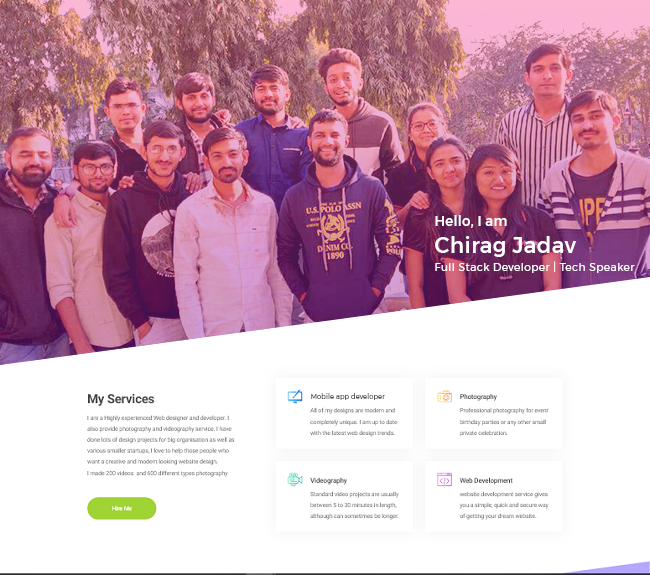
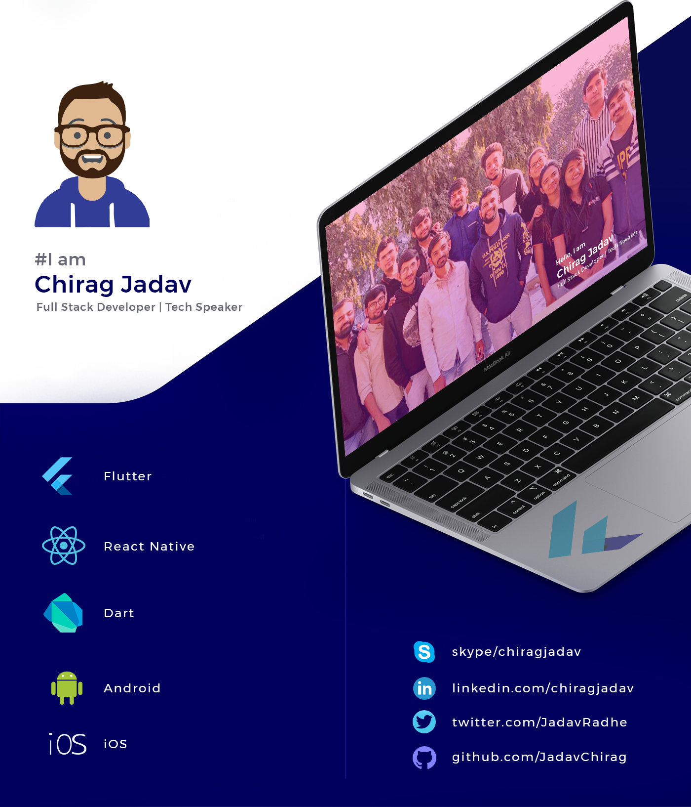

# About Me
 
 

## What is it?

Simple portfolio to show some brief information about me, my skills and Projects.

## Getting Started

Clone/download the repository and move to the project folder.

## Usage for 'hellochirag' 😅

Open `index.html` in your favorite browser to preview/edit the project at the `./`dir folder or go to the link provided at the top to preview it.
The '404.html' is a cool 'Page Not Found' page

## Issues

If you have a problem or see a bug. Please, create an issue explaining what happened, I promice to resolve the issue as quick as possible.
Same goes for feature requests.

## Feedback

I will be glad to listen any constructive feedback.

## License

MIT © 2020

